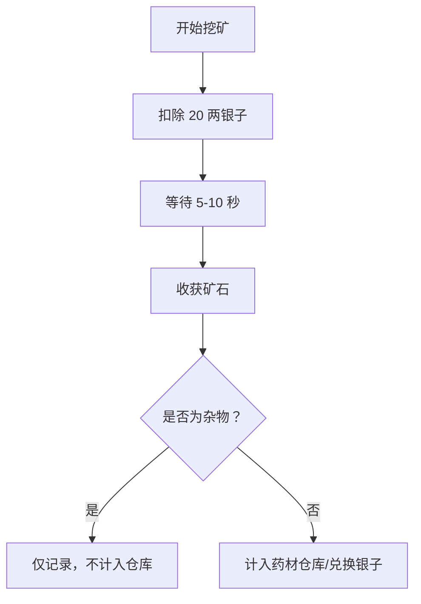
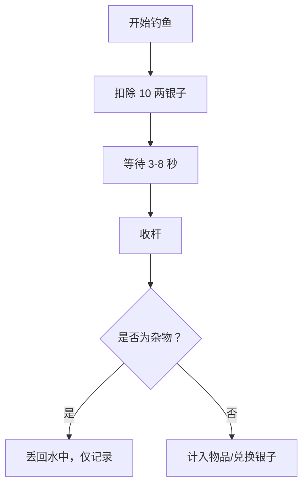

# 挖矿与钓鱼游戏优化文档

## 优化概述

本次优化为"挖矿"和"钓鱼"两个小游戏增加了：
1. **垃圾物品系统** - 有机会获得无法兑换的无用物品
2. **运势影响系统** - 用户当日运势会影响物品获取概率

---

## 一、运势计算系统

### 运势等级映射

| 运势类型 | 运势值 | 说明 |
|---------|--------|------|
| great_luck (大吉) | 95 | 运势极佳，珍品概率大幅提升 |
| medium_luck (中吉) | 67.5 | 运势不错，有小概率获得珍品 |
| small_luck (小吉) | 52 | 运势平稳，略有加成 |
| small_misfortune (小凶) | 34.5 | 运势不佳，垃圾物品概率增加 |
| misfortune (大凶) | 12 | 运势极差，容易挖到/钓到垃圾 |

### 运势加成公式

```
fortune_bonus = (fortune_value - 50) * 0.35
```

**效果范围：-17.5% 到 +17.5%**

- **大吉 (95)**: +15.75% 概率提升高品质物品
- **中吉 (67.5)**: +6.13% 概率提升
- **小吉 (52)**: +0.7% 概率提升
- **小凶 (34.5)**: -5.43% 概率降低
- **大凶 (12)**: -13.3% 概率降低，垃圾物品概率大幅增加

---

## 二、概率调整机制

### 挖矿基础概率

| 稀有度 | 基础概率 | 说明 |
|--------|----------|------|
| legendary | 1% | 千年寒铁、天外陨铁 |
| epic | 6% | 秘银、精金 |
| rare | 15% | 水晶、翡翠 |
| uncommon | 20% | 铜矿、铁矿 |
| common | 23% | 普通矿石 |
| **trash** | **35%** | 碎石块、矿泉水瓶、废弃矿渣 |

### 钓鱼基础概率

| 稀有度 | 基础概率 | 说明 |
|--------|----------|------|
| legendary | 5% | 千年灵鱼、蛟龙筋 |
| epic | 10% | 金枪鱼、龙趸 |
| rare | 15% | 石斑鱼、鲈鱼 |
| uncommon | 20% | 鲫鱼、鲤鱼 |
| common | 20% | 小鱼、虾米 |
| **trash** | **30%** | 漂流瓶、矿泉水瓶、破旧水草 |

### 运势影响后的实际概率示例

**大吉运势 (+15.75%)**：
- legendary: 1% → 16.75% (大幅提升)
- trash: 35% → 19.25% (大幅降低)

**大凶运势 (-13.3%)**：
- legendary: 1% → 0% (几乎不可能)
- trash: 35% → 48.3% (接近一半是垃圾)

---

## 三、垃圾物品列表

### 挖矿垃圾物品（5 种）

1. **碎石块** - 毫无价值的石头
2. **矿泉水瓶** - 不知道谁丢的垃圾
3. **废弃矿渣** - 提炼过的废渣
4. **破布片** - 腐烂的布料
5. **烂木头** - 腐朽的木

### 钓鱼垃圾物品（10 种）

1. **漂流瓶** - 空瓶子一个
2. **矿泉水瓶** - 又是瓶子...
3. **破旧水草** - 腐烂的水草
4. **烂鱼钩** - 生锈的鱼钩
5. **破旧靴子** - 不知道谁丢的鞋子
6. **腐烂鱼饵** - 已经发臭的鱼饵

---

## 四、游戏机制变化

### 挖矿流程变化



### 钓鱼流程变化



---

## 五、前端显示优化

### 记录列表样式

- **杂物物品**:
  - 半透明显示（opacity: 0.7）
  - 灰色边框（#4a5568）
  - 类型显示为"垃圾"
  - 效果显示"🗑️ 无价值"

- **普通物品**:
  - 正常显示
  - 按稀有度着色
  - 显示实际效果（内力/体力/银子）

### 提示消息

- **获得杂物**: *"唉！您挖到了【碎石块】，这是一无用的废物，已丢到一旁。"*
- **获得珍品**: *"恭喜！您挖到了【千年寒铁】！已放入药材仓库，可用于炼丹！"*

---

## 六、数据库变更

### 新增物品数据

```sql
-- 挖矿垃圾物品
INSERT INTO mining_items (item_name, item_type, effect_neili, effect_tili, silver_value, rarities, image_file) VALUES
('碎石块', '杂物', 0, 0, 0, 'trash', ''),
('矿泉水瓶', '杂物', 0, 0, 0, 'trash', ''),
('废弃矿渣', '杂物', 0, 0, 0, 'trash', ''),
('破布片', '杂物', 0, 0, 0, 'trash', ''),
('烂木头', '杂物', 0, 0, 0, 'trash', '');

-- 钓鱼垃圾物品
INSERT INTO fishing_items (item_name, item_type, effect_neili, effect_tili, silver_value, rarities, image_file) VALUES
('漂流瓶', '杂物', 0, 0, 0, 'trash', ''),
('矿泉水瓶', '杂物', 0, 0, 0, 'trash', ''),
('破旧水草', '杂物', 0, 0, 0, 'trash', ''),
('烂鱼钩', '杂物', 0, 0, 0, 'trash', ''),
('破旧靴子', '杂物', 0, 0, 0, 'trash', ''),
('腐烂鱼饵', '杂物', 0, 0, 0, 'trash', '');
```

### 数据库表无需变更

- 使用现有的 `rarities = 'trash'` 标识垃圾物品
- 使用 `item_type = '杂物'` 判断是否计入仓库

---

## 七、核心代码逻辑

### 运势获取函数

```javascript
async function getTodayFortune(username) {
  const [fortunes] = await db.execute(
    'SELECT fortune_type FROM user_fortunes WHERE username = ? AND fortune_date = CURDATE()',
    [username]
  );
  
  if (fortunes.length === 0) return 50;
  
  const fortuneMap = {
    'great_luck': 95,
    'medium_luck': 67.5,
    'small_luck': 52,
    'small_misfortune': 34.5,
    'misfortune': 12
  };
  
  return fortuneMap[fortunes[0].fortune_type] || 50;
}
```

### 概率调整函数

```javascript
function getAdjustedRarity(fortuneValue) {
  const fortune_bonus = (fortuneValue - 50) * 0.35;
  
  return {
    legendary: { threshold: Math.max(1, 3 - fortune_bonus) },
    epic: { threshold: Math.max(4, 10 - fortune_bonus * 0.8) },
    rare: { threshold: Math.max(11, 25 - fortune_bonus * 0.6) },
    uncommon: { threshold: Math.max(26, 45 - fortune_bonus * 0.4) },
    common: { threshold: Math.max(46, 65 - fortune_bonus * 0.3) },
    trash: { threshold: 100 }
  };
}
```

---

## 八、玩法策略建议

### 根据运势调整策略

1. **大吉日**：
   - 适合大量挖矿/钓鱼
   - 珍品概率高，收益最大

2. **大凶日**：
   - 建议休息或进行其他活动
   - 垃圾物品概率接近 50%

3. **平日**：
   - 正常游戏即可
   - 细水长流，积累资源

### 资源管理

- 挖矿每次消耗 20 两银子
- 钓鱼每次消耗 10 两银子
- 根据运势决定投入多少资源

---

## 九、测试建议

1. **测试运势获取**：
   - 先求签获取今日运势
   - 在大吉和大凶日分别测试
   - 验证概率差异

2. **测试垃圾物品**：
   - 多次挖矿/钓鱼
   - 验证杂物概率是否符合预期
   - 检查杂物是否不计入仓库

3. **测试前端显示**：
   - 查看记录列表样式
   - 验证杂物半透明显示
   - 检查提示信息

---

## 十、后续优化建议

1. **运势道具**：
   - 添加"改运符"道具，临时提升运势
   - 限时 buff，增加策略性

2. **垃圾回收**：
   - 添加回收系统，10 个垃圾兑换 1 两银子
   - 减少完全无用的挫败感

3. **成就系统**：
   - "倒霉蛋"：连续 10 次挖到垃圾
   - "幸运儿"：连续 3 次挖到珍品

4. **运势提示**：
   - 在挖矿/钓鱼界面显示今日运势
   - 给出"今日宜/不宜"提示

